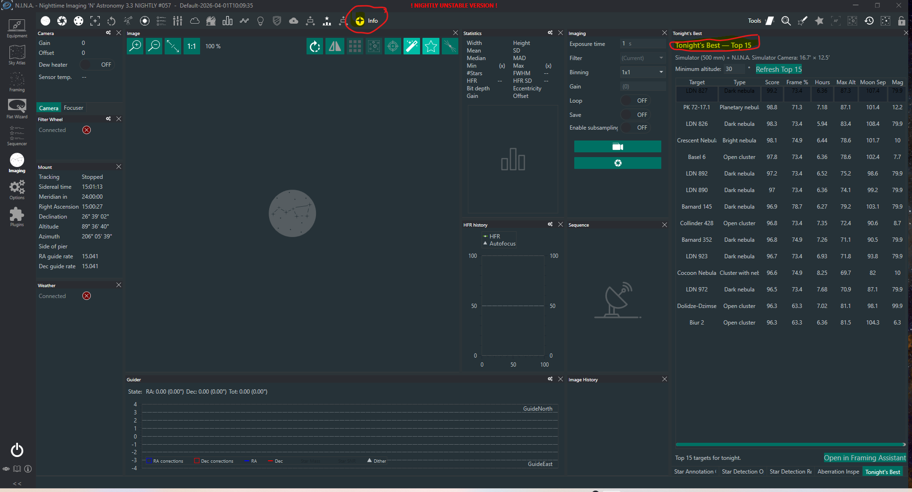

# Tonight's Best for N.I.N.A.

Tonight's Best is a N.I.N.A. 3.2 plugin that ranks deep-sky targets for
the current night using the active N.I.N.A. profile, equipment, sky atlas, Moon,
and visibility window. It provides a dockable **Top 15** panel with one-click
handoff to the Framing Assistant and then the Advanced Sequencer.

[](https://ccdastro.github.io/TonightsBest-NINA/)

*Tonight's Best docked in the N.I.N.A. Imaging workspace. Click the image to
open the one-page guide.*

## Install

Tonight's Best requires **N.I.N.A. 3.2.0.9001 or later**.

### N.I.N.A. Plugin Manager

Once the plugin is listed in N.I.N.A.'s official repository:

1. Open **Plugins** in N.I.N.A.
2. Search for **Tonight's Best**.
3. Select it, install it, and restart N.I.N.A. when requested.

Future versions will then appear through N.I.N.A.'s normal plugin-update system.

### Manual installation

1. Download `TonightsBest.NINA.Plugin.<version>.zip` from this repository's
   [Releases](https://github.com/CCDASTRO/TonightsBest-NINA/releases) page.
2. Close N.I.N.A. completely before copying any plugin files.
3. Open Windows **File Explorer** (`Windows key + E`). Click its address bar,
   paste `%LOCALAPPDATA%\NINA\Plugins`, and press **Enter**. This opens the
   correct N.I.N.A. plugin directory for your Windows account; you do not need
   to find the normally hidden `AppData` folder manually.
4. Inside `Plugins`, create a folder named `3.0.0` if it is not already there.
   Open `3.0.0`, then create and open a folder named exactly `Tonight's Best`.
5. Open the downloaded ZIP and copy these two files directly into the
   `Tonight's Best` folder:

   - `TonightsBest.Core.dll`
   - `TonightsBest.NINA.Plugin.dll`

   The finished layout must be:

   ```text
   %LOCALAPPDATA%\NINA\Plugins\3.0.0\Tonight's Best\
   ├── TonightsBest.Core.dll
   └── TonightsBest.NINA.Plugin.dll
   ```

   Do not leave the DLLs inside the ZIP or an additional nested folder.
6. Start N.I.N.A. Open **Imaging**, locate **Tonight's Best** among the dockable
   panels, and place or resize it as desired.

N.I.N.A. uses the `3.0.0` compatibility folder for 3.x plugins even though this
plugin requires N.I.N.A. 3.2 or newer.

## Required setup

Tonight's Best reads N.I.N.A.'s active profile; it does not maintain a duplicate
equipment or location configuration. Before refreshing:

1. Set the observing latitude, longitude, elevation, and optional custom horizon
   in the active N.I.N.A. profile.
2. Select a telescope and enter its effective focal length, including any reducer
   or Barlow effect.
3. Select and connect the camera. N.I.N.A. must report its sensor width, sensor
   height, and pixel size so the plugin can calculate the field of view.
4. Simulator equipment can be used to evaluate the plugin without physical
   hardware.

## Use

1. Open the **Tonight's Best — Top 15** panel in the Imaging workspace.
2. Set the minimum acceptable target altitude; the default is 30°.
3. Click **Refresh Top 15**.
4. Compare object type, overall score, estimated frame coverage, hours above the
   minimum altitude, maximum altitude, Moon separation, and magnitude.
5. Select a row and click **Open in Framing Assistant**.
6. Adjust rotation, framing, or mosaic settings, then use Framing Assistant's
   normal controls to add the target to the Advanced Sequencer.

## Understanding the results

The overall score combines:

- visibility above the minimum altitude: 35 points;
- Moon clearance adjusted by illuminated fraction: 25 points;
- framing suitability: 25 points;
- maximum altitude: 10 points;
- broad object-interest prior: 5 points.

Frame coverage is the catalog object's elliptical area divided by the camera's
rectangular field area. Values over 100% indicate that the catalog footprint is
larger than the field. It is an estimate—not a promise that all faint extensions
fit. Objects with missing catalog dimensions remain eligible but receive a
low-confidence framing score.

## Troubleshooting

- **Camera dimensions unavailable:** connect the selected camera so N.I.N.A. can
  report its sensor dimensions and pixel size.
- **Invalid telescope focal length:** enter the effective focal length in the
  active profile.
- **No targets meet the altitude requirement:** lower the minimum altitude or
  verify the active profile's location.
- **Panel is missing:** open the Imaging workspace and restore or add the
  **Tonight's Best** dockable panel.

## License

MIT. N.I.N.A. itself and its SDK packages retain their own licenses.
